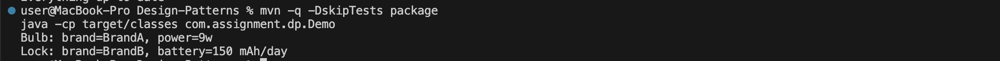

- # design-patterns-assignment1

 ## Test
 mvn -q -DskipTests=false test

## Execution Proof

**Demo output**

**JUnit test summary**

+# Assignment Context
+This project follows the assignment brief: use an **Abstract Factory** to create
+two related product families (Smart Bulb, Smart Lock) for two brands (A, B),
+and use a **Factory Method** inside the product classes to load usage values
+from a data file *after* the object is created. Demo includes a Brand A Bulb
+and a Brand B Lock, plus tests and a UML diagram. :contentReference[oaicite:1]{index=1}
+
+**Why this design fits:**
+- *Abstract Factory*: `SmartDeviceFactory` with `BrandAFactory` and `BrandBFactory`
+  creates brand-specific `SmartBulb` and `SmartLock`.
+- *Factory Method*: `AbstractBulb.readUsage(...)` and `AbstractLock.readUsage(...)`
+  are overridable per brand (e.g., Brand B parses `power=` / `battery=`).
+
+**Deliverables mapping:**
+- UML diagram (in `docs/uml/`)
+- Demo: Brand A Bulb & Brand B Lock
+- Tests: JUnit 5 under `src/test/...`
+- README with run/test instructions and execution screenshots

+ # Assignment 1 — Design Patterns (Abstract Factory + Factory Method)
+ 
+ This project implements an Abstract Factory for smart devices (Bulb, Lock) across two brands,
+ and uses a Factory Method inside products to load usage values from files after creation.
+ 
+ ## Repository Structure
+ .
+ ├── data/
+ │   ├── brandA_bulb.txt
+ │   └── brandB_lock.txt
+ ├── src/
+ │   └── main/java/com/assignment/dp/...
+ └── src/
+     └── test/java/com/assignment/dp/SmartDevicesTest.java
+ 
+ ## How to Run (no build tool)
+ javac -d out $(find src/main/java -name "*.java")
+ java -cp out com.assignment.dp.Demo
+ 
+ ## How to Run (Maven)
+ mvn -q -DskipTests package
+ java -cp target/classes com.assignment.dp.Demo
+ 
+ ## Test (JUnit 5 with Maven)
+ mvn -q -DskipTests=false test
+ 
+ ## Tests Included
+ - Brand A Bulb loads integer watts from file
+ - Brand B Lock loads `battery=NNN` from file
+ - Graceful fallbacks on missing/invalid files
+ 
+ ## Execution Proof
+ - Screenshot of demo output
+ - Screenshot of `mvn test` summary
+ 
+ _Assignment reference included._ 